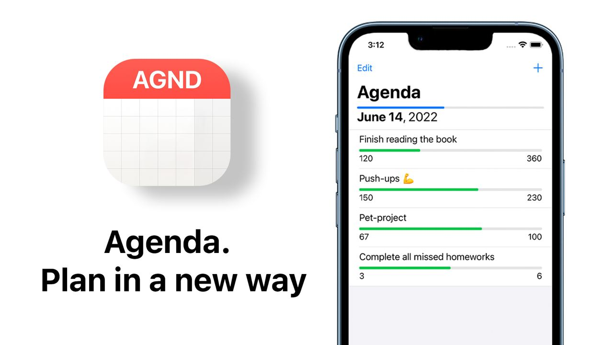
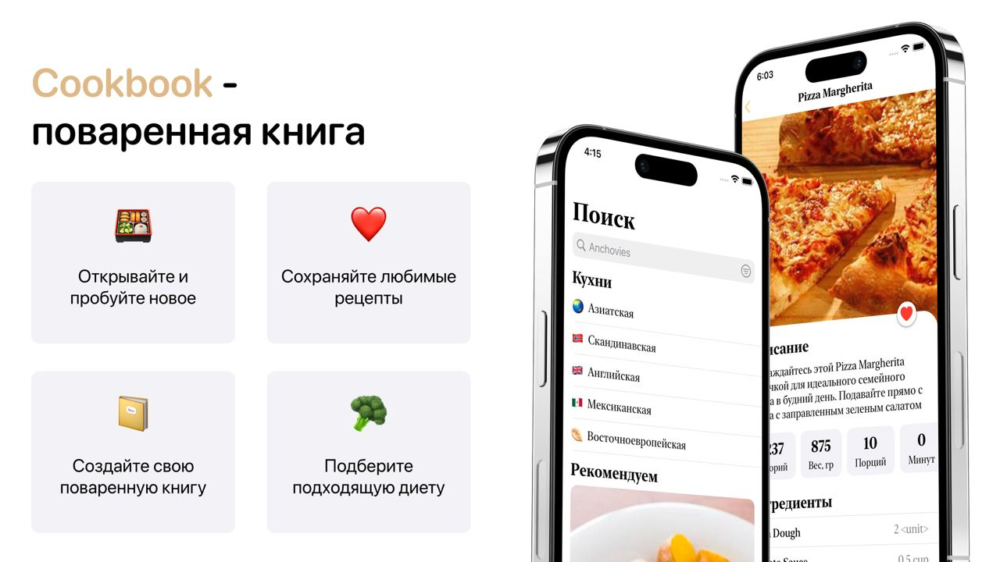

# Portfolio

## Agenda

An application that allows you to track goals for a month 
[GitHub](https://github.com/htmlprogrammist/Agenda) | [YouTube](https://youtu.be/Pw6n4QYfHaQ)

- iOS 13.0+
- UIKit
- Core Data
- Human Interface Guidelines
- VIPER + Coordinator
- SOLID
- Localization
- Writing Unit/UI tests using XCTest
- Grand Central Dispatch
- Notification Center
- [Swift Package Manager](https://www.swift.org/package-manager/) as a dependency manager

## Cookbook

Recipes application 
[GitHub](https://github.com/iCookbook) | [Presentation](https://drive.google.com/file/d/1vXaAaW-q5Q1CIdaIX6W5RSu7f6Z_FQ6y/view?usp=sharing)

- iOS 12.0+
- Modular architecture
- CocoaPods as a dependency manager
- Without using third-party libraries
- UIKit
- VIPER
- SOLID
- URLSession
- Core Data
- Grand Central Dispatch
- Localization & Pluralization
- Custom Fonts
- Writing Unit tests using XCTest

## EmojiPicker

EmojiPicker is a customizable package implementing macOS-style emoji picker popover 
[GitHub](https://github.com/htmlprogrammist/EmojiPicker)

- iOS 11.1+ & Swift 4.2+
- Installation using CocoaPods / Swift Package Manager / Manually
- MVVM
- Localization
- Dark theme
- Testing (Unit tests using XCTest)
- CI is configured on GitHub Actions

[<< Back to profile](https://github.com/htmlprogrammist)
